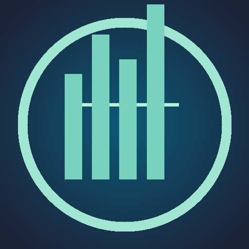
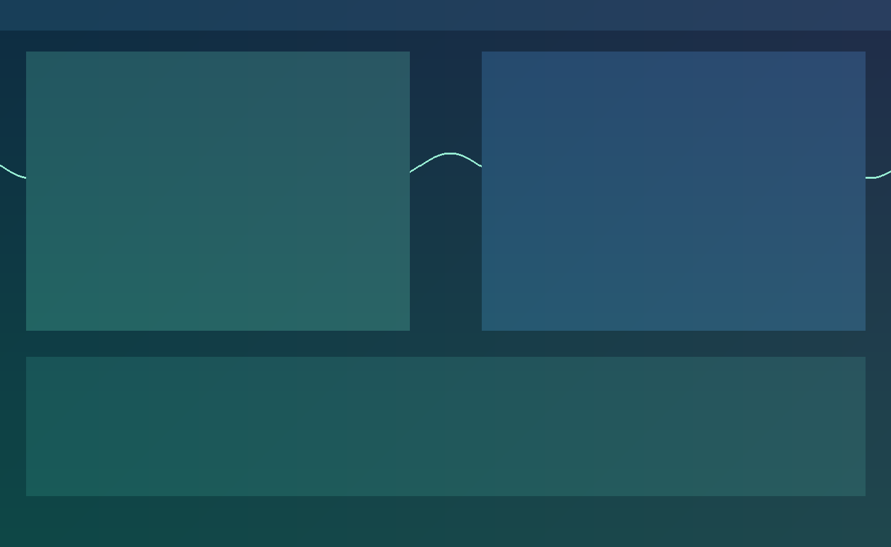
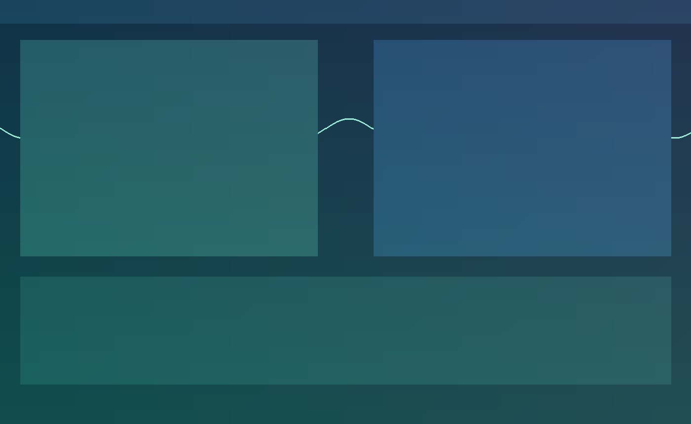
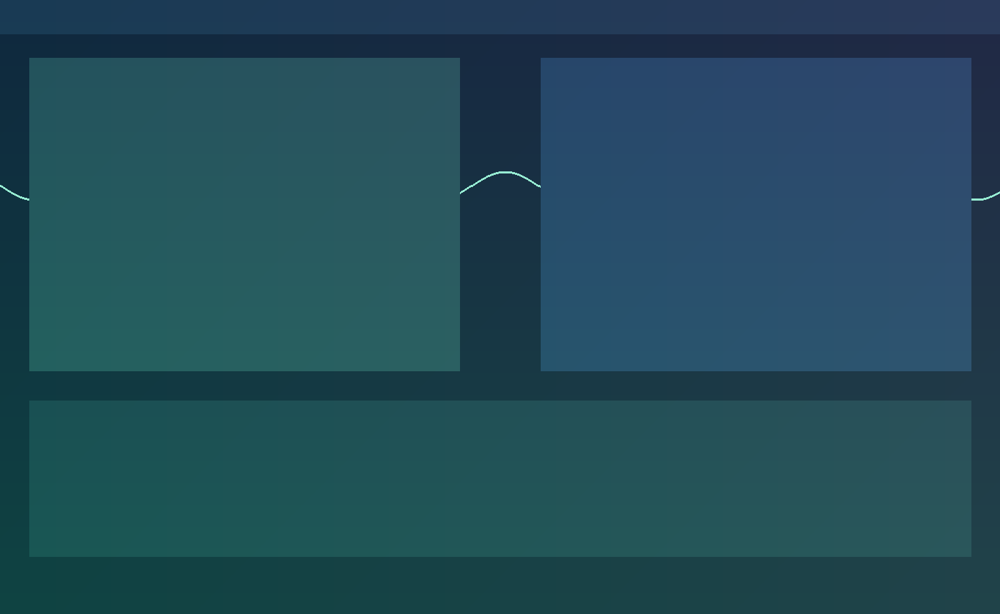
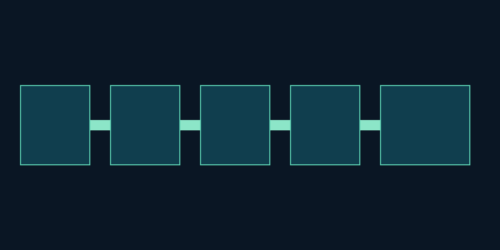

<div align="center">
  

  <h1>ReconcileIQ</h1>

  <p><strong>Matching, score de confiança e resolução de exceções para reconciliação financeira-operacional.</strong></p>
  <p><strong>Confidence-scored matching and exception resolution for operational financial reconciliation.</strong></p>

  <p>
    <a href="#-visão-geral--overview">PT-BR / English Overview</a> •
    <a href="#-product-preview">Preview</a> •
    <a href="#-screenshots">Screenshots</a> •
    <a href="#-stack--tecnologias">Stack</a> •
    <a href="#-arquitetura--architecture">Architecture</a> •
    <a href="#-quick-start--início-rápido">Quick Start</a> •
    <a href="#-autor--author">Author</a>
  </p>

  <p>
    
    
    
    
    
    
  </p>
</div>

<p align="center">
  
</p>

---

## 1. Visão Geral / Overview

O **ReconcileIQ** é um sistema de inteligência de reconciliação que cruza **pedidos, pagamentos e taxas** para encontrar divergências, perdas e exceções. Ele transforma conciliação manual em um fluxo auditável de matching, score de confiança e resolução assistida.

Em vez de comparar planilhas isoladas, o ReconcileIQ normaliza schemas demo, executa matching exato e fuzzy, calcula impacto financeiro e abre uma fila de exceções com trilha de auditoria append-only.

O projeto foi desenvolvido por **Felipe Alirio Baruja** como peça de portfólio, conectando dados aplicados a controle financeiro-operacional, record linkage e backoffice auditável.

> **Responsible Reconciliation Notice**  
> O ReconcileIQ é suporte à decisão operacional com dados demo/sintéticos ou uploads controlados. Ele **não** deve liquidar, estornar ou baixar valores automaticamente sem revisão humana das exceções e da evidência de matching.

---

## ✨ Product Preview

<p align="center">
  
</p>

O ReconcileIQ apresenta uma experiência tipo mesa de auditoria: Matching Workbench, Exception Inbox, Confidence Score, Diff Viewer, Financial Leakage Board e Audit Trail.

---

## 2. Por que este projeto importa? / Why this project matters

* **Dinheiro some na operação:** Marketplaces, delivery e e-commerce recebem dados de várias fontes e perdem tempo (e receita) tentando fechar o ciclo venda → pagamento → taxa.
* **Matching sem confiança é risco:** Um join frágil esconde falsos positivos. O ReconcileIQ expõe método, score e razões.
* **Exceção precisa de workflow:** Divergência sem inbox, severidade e auditoria vira retrabalho e atraso de fechamento.
* **Portfólio com impacto financeiro:** Demonstra record linkage, fuzzy matching, regras, risco operacional e impacto mensurável.

---

## 🧠 O diferencial do ReconcileIQ / What makes ReconcileIQ different

### Português
O ReconcileIQ não é só um dashboard de totais. Ele combina normalização, matching probabilístico e resolução humana assistida em um fluxo rastreável.

Ele mostra não apenas o que bateu, mas também:
- quão confiável é cada par;
- por que o match foi sugerido;
- onde há leakage financeiro;
- quais taxas saíram do esperado;
- o que ainda está aberto na fila de exceções;
- quem alterou o status e quando.

### English
ReconcileIQ is not just a totals dashboard. It combines normalization, probabilistic matching and human-assisted resolution into one traceable workflow.

It shows not only what matched, but also:
- how confident each pair is;
- why a match was suggested;
- where financial leakage sits;
- which fees drifted from expectation;
- what remains open in the exception inbox;
- who changed status and when.

---

## 🎯 Problema que resolve / The problem it solves

Em operações reais, a reconciliação costuma falhar por:
- schemas diferentes entre pedidos, pagamentos e taxas;
- referências quebradas ou tipadas de forma inconsistente;
- nomes de pagadores com variação ortográfica;
- taxas cobradas acima do esperado;
- pagamentos órfãos e pedidos sem settlement;
- ausência de score de confiança e trilha de auditoria;
- fechamento mensal atrasado por retrabalho manual.

O **ReconcileIQ** cria uma camada auditável entre o extrato bruto e a decisão de resolução.

---

## 🧩 Proposta / Reconciliation Pipeline

```txt
Demo CSVs (orders / payments / fees)
  ↓
Schema normalization
  ↓
Exact matching (external_ref ↔ order_ref)
  ↓
Fuzzy candidate search (RapidFuzz + amount proximity)
  ↓
Fee anomaly checks
  ↓
Confidence scoring
  ↓
Exception inbox + severity
  ↓
Human resolution actions
  ↓
Append-only audit trail + leakage board
```

---

## 📸 Screenshots

<table>
  <tr>
    <td width="50%">
      
      <br />
      <sub><strong>Matching Workbench</strong> — paired records, method, confidence and financial impact.</sub>
    </td>
    <td width="50%">
      
      <br />
      <sub><strong>Exception Inbox</strong> — prioritized exceptions with severity and resolution actions.</sub>
    </td>
  </tr>
  <tr>
    <td width="50%">
      
      <br />
      <sub><strong>Confidence Score</strong> — exact/fuzzy methods with explainable penalties.</sub>
    </td>
    <td width="50%">
      
      <br />
      <sub><strong>Diff Viewer</strong> — side-by-side order vs payment/fee inspection.</sub>
    </td>
  </tr>
  <tr>
    <td width="50%">
      
      <br />
      <sub><strong>Financial Leakage Board</strong> — unmatched volume, fee anomalies and open exceptions.</sub>
    </td>
    <td width="50%">
      
      <br />
      <sub><strong>Audit Trail</strong> — append-only events for reconciliation and resolution actions.</sub>
    </td>
  </tr>
</table>

---

## 📄 Executive Reconciliation Memo

<p align="center">
  
</p>

O memo executivo consolida matched volume, leakage, anomalias de taxa, exceções abertas e próximos passos de fechamento.

---

## 📌 Estudo de Caso / Case Study

### 📌 Estudo de Caso: Settlement sintético de marketplace
O dataset demo simula um dia operacional com **12 pedidos**, **12 pagamentos** e **11 taxas**. Há matches exatos, pares fuzzy (nome/ref aproximados), anomalias de comissão e um pagamento órfão.

O ReconcileIQ executa matching, calcula confidence score, roteia exceções por severidade financeira e registra cada abertura/resolução na trilha de auditoria.

### 📌 Case Study: Synthetic marketplace settlement
The demo dataset simulates an operational day with **12 orders**, **12 payments** and **11 fees**. It includes exact matches, fuzzy pairs (approximate name/ref), commission anomalies and one orphan payment.

ReconcileIQ runs matching, computes confidence scores, routes exceptions by financial severity and records every open/resolve action in the audit trail.

---

## 🧭 Visual Story / Jornada Analítica

```txt
1. Carregar os 3 arquivos demo (pedidos, pagamentos, taxas)
2. Rodar reconciliação no Leakage Board
3. Inspecionar pares no Matching Workbench
4. Abrir o Diff Viewer do candidato selecionado
5. Priorizar a Exception Inbox por severidade/impacto
6. Confirmar, investigar ou write-off com nota
7. Validar o evento na Audit Trail
8. Ler o memo de fechamento / risco de caixa
```

---

## ⚙️ Funcionalidades Principais / Core Features

### Matching Workbench
Mesa de trabalho com candidatos exact/fuzzy, método usado, confidence score e impacto financeiro.

### Exception Inbox
Fila de exceções com severidade, descrição, ação sugerida e resolução manual assistida.

### Confidence Score
Pontuação explicável com bônus para join exato e penalidades por delta de valor/taxa e similaridade fuzzy.

### Diff Viewer
Comparação lado a lado entre pedido e pagamento/taxa para revisão humana rápida.

### Financial Leakage Board
Resumo de volume matched, leakage, anomalias de taxa e exceções abertas.

### Audit Trail
Log append-only de runs de reconciliação e ações humanas de resolução.

---

## 🛠️ Stack / Tecnologias

### Frontend
- **Framework:** Next.js 15 (App Router) & React 19
- **Linguagem:** TypeScript
- **UI:** CSS variables + workbench layout
- **Ícones:** Lucide Icons
- **Charts-ready:** Recharts

### Backend
- **Framework API:** FastAPI & Uvicorn (Python 3.12)
- **Modelagem & Validação:** Pydantic v2
- **Processamento:** Pandas
- **Matching:** RapidFuzz
- **Suite de Testes:** Pytest

---

## 🧱 Arquitetura / Architecture

O projeto adota uma arquitetura monorepo simplificada e desacoplada:

```text
ReconcileIQ/
├── apps/
│   ├── web/                         # Frontend Next.js (App Router)
│   │   ├── app/                     # Página principal do workbench
│   │   ├── components/              # MatchWorkbench, ExceptionInbox
│   │   ├── lib/                     # API client
│   │   └── types/                   # Tipos TypeScript
│   │
│   └── api/                         # Backend FastAPI
│       ├── app/
│       │   ├── api/                 # Endpoints (/demo, /reconcile, /audit)
│       │   ├── models/              # Schemas Pydantic
│       │   └── services/            # Matching, demo data, audit state
│       └── tests/                   # Testes pytest
│
├── data/
│   └── seed/                        # orders/payments/fees demo CSVs
│
├── docs/                            # Pitch e metodologia
├── assets/                          # Ícone, hero, screenshots
├── start.bat                        # Inicializador Windows
└── README.md                        # Esta documentação
```

---

## 🧱 Visual Architecture

<p align="center">
  
</p>

ReconcileIQ follows a traceable reconciliation flow: demo ledgers enter normalization, exact/fuzzy matching, fee checks, confidence scoring, exception routing and audit logging.

---

## 🔁 Data Flow Pipeline

```txt
Raw Demo Ledgers
  ↓
Schema Normalization
  ↓
Exact Reference Join
  ↓
Fuzzy Candidate Ranking (RapidFuzz)
  ↓
Amount + Fee Delta Evaluation
  ↓
Confidence Scoring
  ↓
Exception Classification
  ↓
Human Resolution / Audit Events
  ↓
Leakage Board + Workbench UI
```

---

## 🚀 Quick Start / Início Rápido

### Pré-requisitos
- **Node.js** v20 ou superior.
- **Python** v3.10 ou superior (preferencialmente Python 3.12).
- **Git**

### Opção 1 — Execução integrada no Windows
Na pasta raiz do projeto, dê dois cliques ou execute no console:
```bash
start.bat
```
Este script inicializa automaticamente o ambiente virtual Python (`.venv`), instala as dependências, inicia o backend FastAPI na porta `8000`, o frontend Next.js na porta `3000` e abre a aplicação no navegador padrão.

### Opção 2 — Execução manual

#### 1. Backend FastAPI (`apps/api`)
```bash
cd apps/api
python -m venv .venv
.venv\Scripts\activate            # Windows
source .venv/bin/activate          # Linux/macOS
pip install -r requirements.txt
uvicorn app.main:app --reload --port 8000
```
*API ativa em [http://127.0.0.1:8000](http://127.0.0.1:8000). Docs interativos em `/docs`.*

#### 2. Frontend Next.js (`apps/web`)
```bash
cd apps/web
npm install
npm run dev
```
*Frontend ativo em [http://localhost:3000](http://localhost:3000).*

---

## 🧪 Scripts e Testes / Scripts and Testing

### Gerar seed e assets
```bash
python scripts/generate_assets_and_seed.py
```

### Rodar Testes de Backend (FastAPI/Pytest)
```bash
cd apps/api
.venv\Scripts\python -m pytest
```

### Validações de Frontend (Next.js)
```bash
cd apps/web
npm run lint         # Verificação de lint
npm run typecheck    # Verificação estrita de TypeScript
npm run build        # Compilação de produção
```

---

## 📊 Metodologia de Matching / Matching Methodology

O ReconcileIQ usa record linkage clássico com foco em transparência operacional:
* **Exact join:** `orders.external_ref` ↔ `payments.order_ref`.
* **Fuzzy matching:** RapidFuzz (`token_sort_ratio` em nomes, `partial_ratio` em referências) + proximidade de valor.
* **Fee anomaly:** compara taxa cobrada vs `expected_rate × net_amount`.
* **Confidence score:** parte alto em matches exatos e penaliza deltas materiais.
* **Exception routing:** unmatched, low-confidence e divergências financeiras vão para a inbox.
* **Human-in-the-loop:** confirm / investigate / write-off com auditoria.

Detalhes em [docs/methodology.md](./docs/methodology.md).

---

## 🛡️ Segurança e Boas Práticas

* **Sem segredos no repositório:** apenas `.env.example`; `.env` está no `.gitignore`.
* **Demo-first:** seeds sintéticos, sem integração bancária real no MVP.
* **Resolução humana obrigatória** para write-offs e confirmações sensíveis.
* **Audit trail append-only** para rastreabilidade de decisões.

---

## 🧭 Roadmap do Produto

* **MVP:** Importar 3 arquivos demo; matching exato/fuzzy; confidence; exception inbox; audit trail; leakage board.
* **Fase 2:** Regras configuráveis, reconciliação N:N, sugestões explicáveis, métricas por fonte, exportação contábil, alertas de taxa.
* **Fase 3:** Conectores mock (Mercado Pago/Stripe/Sheets/ERP), aprendizado com decisões humanas, fechamento mensal e dashboard de risco de caixa.
* **Fora de escopo:** contabilidade fiscal completa, bancos reais no MVP, app financeiro pessoal.

---

## 💼 Valor para Portfólio / Portfolio Value

O ReconcileIQ demonstra competências críticas para funções de **Analytics Engineering, Data/Ops Finance e Full-Stack Data Products**:
- **Record linkage aplicado:** exact + fuzzy com trade-off precisão/recall.
- **Controle financeiro-operacional:** leakage, taxas e exceções com impacto monetário.
- **Produto auditável:** confiança, razões e trilha de decisão humana.
- **Arquitetura Full-Stack:** Next.js 15 + FastAPI em monorepo.

---

## 📚 Documentação Complementar

- [docs/portfolio_pitch.md](./docs/portfolio_pitch.md) — roteiro de entrevista e demo de 3 minutos.
- [docs/methodology.md](./docs/methodology.md) — metodologia de matching e limites interpretativos.

---

## 🖼️ GitHub Social Preview

Uma imagem para visualização social está disponível em:
```txt
assets/social-preview.png
```
*Dimensão recomendada: 1280x640, <1MB. Faça upload em: Repository Settings → Social Preview.*

---

## 🔖 GitHub Repository Metadata

### About sugerido
```txt
Reconciliation intelligence: exact/fuzzy matching for orders, payments and fees with confidence scores, exception inbox and audit trail.
```

### Topics sugeridos
```txt
reconciliation
record-linkage
fuzzy-matching
rapidfuzz
fastapi
nextjs
typescript
python
exception-management
audit-trail
finops
portfolio-project
marketplace
ecommerce
data-product
```

---

## 👤 Autor / Author

Desenvolvido por **Felipe Alirio Baruja**.

- **Portfolio:** [barujafe.vercel.app](https://barujafe.vercel.app/)
- **GitHub:** [@BarujaFe1](https://github.com/BarujaFe1)
- **LinkedIn:** [Felipe Alirio Baruja](https://www.linkedin.com/in/barujafe/)

---

## 📄 Licença / License

MIT License. Copyright (c) 2026 Felipe Alirio Baruja.
O código está disponível sob a licença MIT caso o arquivo `LICENSE` esteja presente no repositório.
